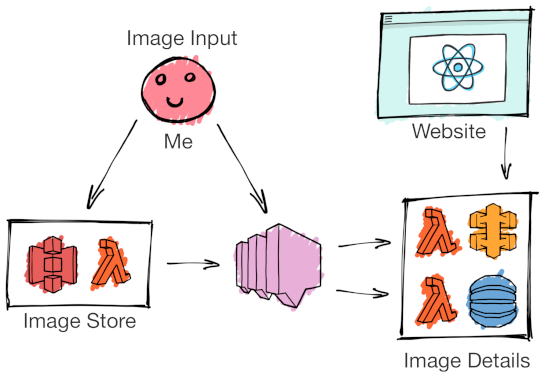

# Draw by Days

[](https://circleci.com/gh/SketchingDev/draw-by-days/tree/master)
[](https://coveralls.io/github/SketchingDev/draw-by-days?branch=master)

Draw by Days provides artists (amateur or professional) with an image a day to reproduce in their particular medium. The 
more days you complete the better you'll get - or at least I'm hoping!


## Features

 - [X] Display random image each day
 - [ ] Display random image suitable for drawing practise
 - [ ] Ability for users to upload their drawings

## Technologies

 * AWS Lambda / API Gateway / DynamoDB / S3 / SQS
 * Serverless Framework
 * NodeJS / TypeScript / Lerna / Yarn
 * CircleCI

## Overview

<p align="center">
  
</p>


 * [Website](packages/website) - Website that displays the images for each day
 * [Daily Image API](packages/daily-image-api) - Public API for the 'daily image'
 * [Image Storage](packages/image-storage) - Public S3 bucket that hosts image files. New images invokes a command to Daily Image API to create a new 'daily image'
 * [Image Ingest](packages/image-ingest) - Scheduled service that ingests an image from external providers and saves directly to the Image Storage's S3 bucket


## Commands

Run integration tests (tests scoped from Lambda to dependency)

```
yarn test
```

Run component tests (test deployed service)

```
yarn test:component
``` 

Deploy to development environment

```
yarn deploy:dev
```
