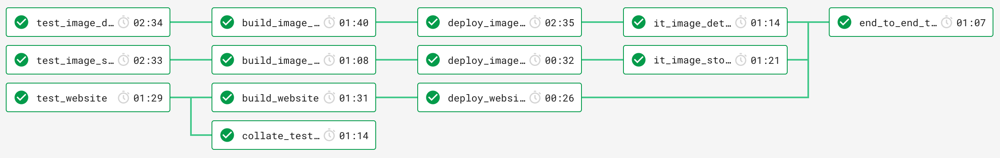

# Draw by Days

Draw by Days is project that I've been using to explore the emerging serverless offerings of AWS. Take a look around,
you'll find:

  * Event-driven architecture with SNS as the backbone
  * Serverless microservices (deployed independently)
  * Wiki pages explaining my findings

Besides a learning exercise I'm hoping this project will provide artists (amateur or professional) with an image a day
to reproduce in their particular medium. The more days you complete the better you'll get - or at least I'm hoping!

## Technologies

 * AWS Lambda / DynamoDB / SNS / API Gateway / S3
 * Terraform / Terragrunt / Terratest
 * NodeJS / TypeScript / Lerna / Yarn
 * CircleCI

## Overview

### Architecture

::Whizzy diagram coming soon::

 * [Image Details Service](packages/image-details-service) - Exposes url and details of all stored images
 * [Image Store Service](packages/image-store-service) - Publicly accessible S3 bucket of images
 * [Website](packages/website) - An unloved website that will present the images

### Project structure

I'll start by explaining how each microservice is separated by its code and infrastructure:

 * `packages/` - Code and [component tests](https://microservices.io/patterns/testing/service-component-test.html) for services
 * `terraform/` - Infrastructure for services 
   * `modules/` - Module per service *(sub-modules common between services are stored in a [separate repo][terraform-modules])*
   * `environments/` - Variables for each service per environment
     * `<environment>/<service>/terraform.tfvars`

*This split is due to the convention of node projects living under a `packages` directory and
[Terraform best practises][terraform-best-practises] advising that infrastructure lives under `modules` and
`environments` directories.*

### Continuous delivery pipeline

Next take a look at the CI/CD pipeline which should hopefully show the process of testing, building, deploying each
service independently. Those who think in code can view the [config.yml](./.circleci/config.yml) and for the rest of us
here's an image of the [CI/CD workflow from CircleCI](https://circleci.com/gh/SketchingDev/workflows/draw-by-days/).

*The image has been doctored a little to re-order the jobs, CircleCI seems to enjoy jumbling up the jobs and [this
closed issue](https://discuss.circleci.com/t/properly-sort-jobs-in-workflows/16258) suggests it won't change anytime
soon.*

[terraform]: https://www.terraform.io/
[terraform-best-practises]: https://www.terraform.io/docs/enterprise/workspaces/repo-structure.html
[terragrunt]: https://github.com/gruntwork-io/terragrunt
[terratest]: https://github.com/gruntwork-io/terratest

[terraform-modules]: https://github.com/SketchingDev/draw-by-days-terraform-modules
[sns-subscribed-lambda]: https://github.com/SketchingDev/draw-by-days-terraform-modules/tree/master/sns_subscribed_lambda
