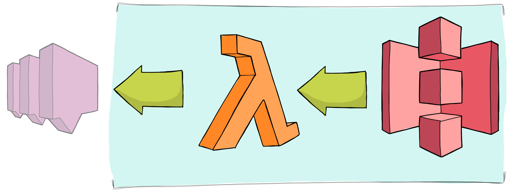

# Image Store Service

Maintains a bucket of publicly accessible images and publishes the URL of newly added images over SNS.

## Architecture




## Advertising new images

When an image is added to the bucket then a message is published over SNS:
 
 * Topic `draw-by-days-<env>-image-on-platform`
 * Message Attributes:
     ```
     {
       event: {
         DataType: "String",
         StringValue: "ImageSource",
       }
     }
     ```
 * Message: [ImageSource](../messages-lib/lib/messages/imageSource.d.ts).
