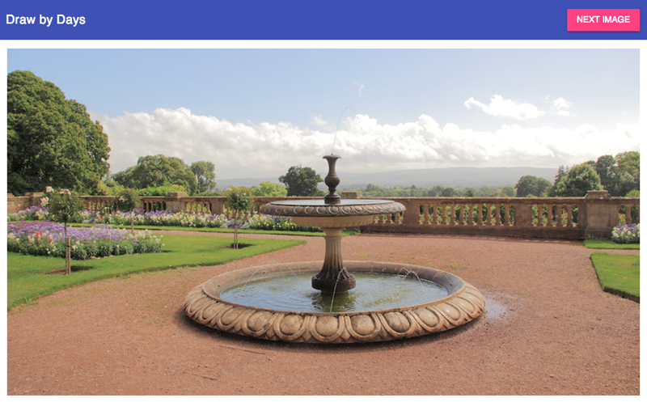
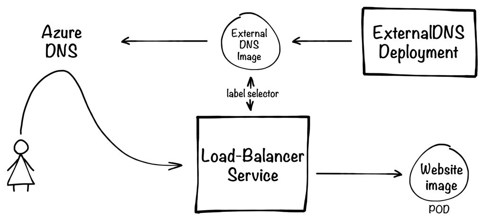

# Website

Provides a front-end website through which people can practise their artistry with a selection of reference material.



## Deployment

Deployment of the service is managed by [Kubernetes][kubernetes] using the YAML definitions:

* `deployment.yml` - Contains a [Deployment][kubernetes-deployment] for 1 pod running the [website's Docker image][docker-image], and 
 below this the definition for a load-balancer service to expose the pod(s).
* `externaldns.yaml` - Creates the [ExternalDNS][external-dns] image to configure Azure DNS records for drawbydays.com to 
point to the IP for the service declared in `deployment.yml`.



*If deploying using [Minikube][minikube] then change the service to NodePort, as the LoadBalancer feature requires a Cloud
 Provider.*

### Useful commands

**Creating deployment**

```
$ kubectl create -f deployment.yml
```

**Updating deployment**

```
$ kubectl apply -f deployment.yml
```


[kubernetes]:https://kubernetes.io/
[kubernetes-deployment]:https://kubernetes.io/docs/concepts/workloads/controllers/deployment/
[docker-image]:https://hub.docker.com/r/sketchingdev/drawbydays-website/
[external-dns]:https://github.com/kubernetes-incubator/external-dns
[minikube]:https://kubernetes.io/docs/getting-started-guides/minikube/